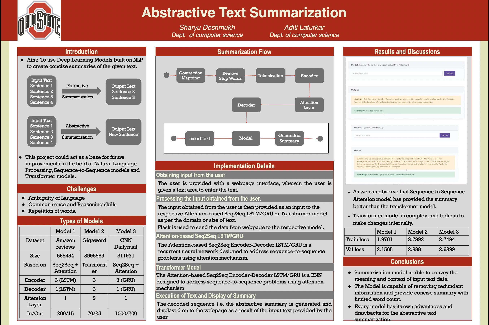
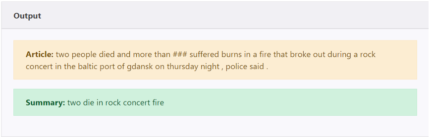

# Abstractive-Summarization

## Introduction
The purpose of this project is to provide short summaries of the given text using NLP based Deep Learning Models. This model would be beneficial for any person like teacher, student, scientist, etc. who doesn’t have time to read large body of text and want the gist of it. This project could also be helpful for developing summary engines/websites where the user could get summaries of any type of text. This project could act as a base for future improvements in the field of Natural Language Processing, Sequence-to-Sequence models and Transformer models.

## Methodology

### Obtaining input from the user: 
The user is provided with a user interface i.e. a webpage, wherein the user is provided with a text area to enter the text.

### Processing the input obtained from the user: 
The input obtained from the user is then provided as an input to the respective Attention-based Seq2Seq LSTM/GRU or Transformer model as per the domain or size of text. Flask framework is used to transfer the data from the webpage to the Python script where the input is processed. Flask is a micro web framework written in Python. It is classified as a micro framework because it does not require particular tools or libraries. It has no database abstraction layer, form validation, or any other components where pre-existing third-party libraries provide common functions.

### Attention-based Seq2Seq LSTM/GRU:
The Attention-based Seq2Seq Encoder-Decoder LSTM/GRU is a recurrent neural network designed to address sequence-to-sequence problems using attention mechanism. Our approach uses the data from a text file wherein the articles and the corresponding summaries are provided. The data is processed into Input and Target tokens. The input tokens are used as an input to the encoder and the target tokens are used as an input to the decoder. The encoded inputs and the decoded inputs are then used to train the model. The decoded sequences are then converted back to a readable form. The user input is then provided to the model to obtain a corresponding decoded sequence i.e. the required summary.

### Transformer Model:
The Transformer is a transduction model which is entirely based on an attention mechanism to draw global dependencies between input and output. It replaces recurrent layers mostly used in encoder-decoder architectures with multi-headed self-attention layers. It allows for significantly more parallelization so it can be trained significantly faster than recurrent or convolution-based architectures.

### Execution of Text and Display of Summary:
The decoded sequence i.e. the abstractive summary is generated and displayed on to the webpage as a result of the input text provided by the user

## Result

